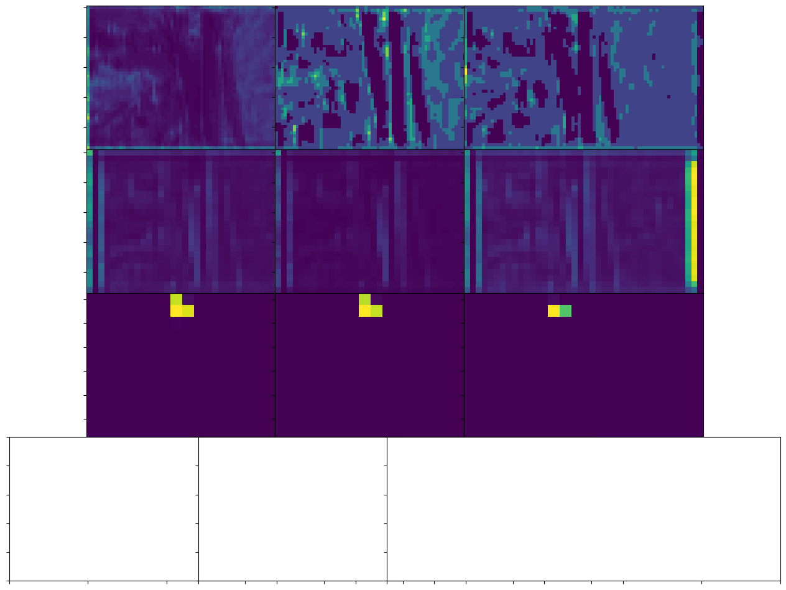
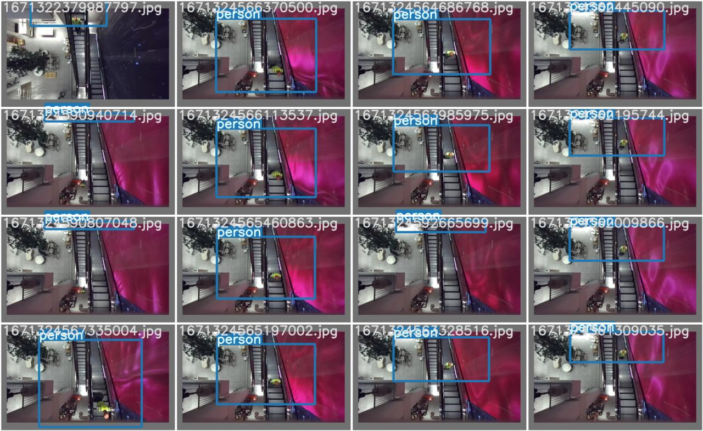

# opencv-spatial-ai
OpenCV Luxonis Spatial AI Contest Submission

### YOLOv7 Tiny Escalator

scripts:
- `yolo_escalators_live.py` : runs live camera with `yolov7escalatorstiny_openvino_2021.4_6shave.blob` model
- `yolo_escalators_replay.py`: WIP attempt using (fails on nn setup), but attempts to load [on site recording](https://drive.google.com/file/d/1OLsdA7FZCgwWtPbNKeAugy_kOHwhKS6f/view?usp=sharing) to be unzipped in the `recordings` folder (1.7GB)

live demo recording:

<video src="https://user-images.githubusercontent.com/189031/208370689-e978f884-a63d-410c-aebe-b98bb558244e.mp4" controls="controls" style="max-width: 730px;">
</video>

Initially testing yolov7 (without OpenVINO) looked promissing:

```python
import sys
sys.path.append('..')
```


```python
import matplotlib.pyplot as plt
import torch
import cv2
from torchvision import transforms
import numpy as np
from utils.datasets import letterbox
```


```python
import os
os.listdir('../runs')
```


    ['test', 'train']


```python
device = torch.device("cuda:0" if torch.cuda.is_available() else "cpu")
weigths = torch.load('../runs/train/yolov7_tiny_escalators_fixed_res3/weights/best.pt')
model = weigths['model']
model = model.half().to(device)
_ = model.eval()
```


```python
image = cv2.imread('../yolov7_escalators_dataset/images/validation/1671322379758650.jpg')  # 640x360 image
image = letterbox(image, 640, stride=64, auto=True)[0]
image_ = image.copy()
image = transforms.ToTensor()(image)
image = torch.tensor(np.array([image.numpy()]))
image = image.to(device)
image = image.half()

output = model(image)
```


```python
obj1 = output[1][0][0, 0, :, :, 4].sigmoid().cpu().numpy()
obj2 = output[1][0][0, 1, :, :, 4].sigmoid().cpu().numpy()
obj3 = output[1][0][0, 2, :, :, 4].sigmoid().cpu().numpy()
obj4 = output[1][1][0, 0, :, :, 4].sigmoid().cpu().numpy()
obj5 = output[1][1][0, 1, :, :, 4].sigmoid().cpu().numpy()
obj6 = output[1][1][0, 2, :, :, 4].sigmoid().cpu().numpy()
obj7 = output[1][2][0, 0, :, :, 4].sigmoid().cpu().numpy()
obj8 = output[1][2][0, 1, :, :, 4].sigmoid().cpu().numpy()
obj9 = output[1][2][0, 2, :, :, 4].sigmoid().cpu().numpy()
# obj10 = output[1][3][0, 0, :, :, 4].sigmoid().cpu().numpy()
# obj11 = output[1][3][0, 1, :, :, 4].sigmoid().cpu().numpy()
# obj12 = output[1][3][0, 2, :, :, 4].sigmoid().cpu().numpy()
```


```python
%matplotlib inline
plt.figure(figsize=(8,8))
plt.axis('off')
plt.imshow(image_[:,:,[2,1,0]])
plt.show()
fig, ax = plt.subplots(4,3,figsize=(16,12))
#[ax_.axis('off') for ax_ in ax.ravel()]
[ax_.set_xticklabels([]) for ax_ in ax.ravel()]
[ax_.set_yticklabels([]) for ax_ in ax.ravel()]
ax.ravel()[0].imshow(obj1)
ax.ravel()[1].imshow(obj2)
ax.ravel()[2].imshow(obj3)
ax.ravel()[3].imshow(obj4)
ax.ravel()[4].imshow(obj5)
ax.ravel()[5].imshow(obj6)
ax.ravel()[6].imshow(obj7)
ax.ravel()[7].imshow(obj8)
ax.ravel()[8].imshow(obj9)
# ax.ravel()[9].imshow(obj10)
# ax.ravel()[10].imshow(obj11)
# ax.ravel()[11].imshow(obj12)
plt.subplots_adjust(wspace=-0.52, hspace=0)
plt.show()
```


    

    


    

    


```python

```

However I mave botched the annotations somehow :facepalm:




### Open3D GPU explorations

The scripts in this section are WIP and require an NVIDIA GPU and Open3D built with GPU support.

For windows users with Python 3.10 and CUDA 11.7 I've compiled a pip wheel from source accessible [here](https://drive.google.com/file/d/1ZN37I0XuR2cNenAarRNhD1GsgGh89JGr/view?usp=sharing)

- `replay_point_cloud.py`: run via `python replay_point_cliud.py -p recordings\3-184430102131341300` (after unzipping the above in the `recordings` folder) -> currently via 


https://user-images.githubusercontent.com/189031/208370689-e978f884-a63d-410c-aebe-b98bb558244e.mp4

