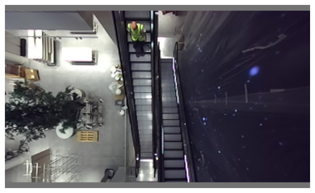

# opencv-spatial-ai
OpenCV Luxonis Spatial AI Contest Submission

### Description  

The KowawahBear project is attempting to address the problem of tracking people on escalators in retail spaces. Computer Vision is seeing a boom of algorithms / models / solutions when it comes to people detection. However, while most options cover front / side facing angles with top / overhead angles, there is very little data to tackle the problem of tracking people on escalators in a retail environment. While the environment offers favorable conditions (such as indoor areas with controlled lighting in most situations) there are also challenges: featureless white walls in vicinity, very restrictive control over the placement and size of camera equipment, the perspective affected by large escalator slopes amplifying occlusions, no control over what people wear (e.g. either highly reflective or highly light absorbent clothing), etc. 
The proposed solution involves building a system that takes advantage of OAK-D-Pro’s features such as active stereo (addressing featureless areas), being able to cover depth at large distances (~35 meters according to docs) as well as its hardware accelerated neural inference capabilities via Intel Movidius and wealth of models the OpenVINO Model Zoo brings. 
It is an opportunity to survey SOTA models on the OAK-D-Pro, both image based (e.g. YOLOv7) as well as point cloud segmentation models (e.g. PointNet++,  PointNet Transformer, etc.). As opposed to prototypes, the solution has the chance to be part of a live project as the input of a large (10x10m) generative art installation in a highly visible retail space on famous Regent St (Oxford Circus area) in Central London.
In summary, the steps to solve this would include:
- Prototype and test performance of a point cloud solution using traditional computer vision techniques (e.g. DBSCAN clustering)
- Train and tune a custom YOLOv7 model taking into account changing scales, occlusions, etc.

The system is currently used in a large retailer on famous Regent St. London affect amazing generative graphics based on people detected on escalators.

### YOLOv7 Tiny Escalator

scripts:
- `yolo_escalators_live.py` : runs live camera with `yolov7escalatorstiny_openvino_2021.4_6shave.blob` model
- `yolo_escalators_replay.py`: WIP attempt using (fails on nn setup), but attempts to load [on site recording](https://drive.google.com/file/d/1OLsdA7FZCgwWtPbNKeAugy_kOHwhKS6f/view?usp=sharing) to be unzipped in the `recordings` folder (1.7GB)

live demo recording:

<video src="https://user-images.githubusercontent.com/189031/208370689-e978f884-a63d-410c-aebe-b98bb558244e.mp4" controls="controls" style="max-width: 730px;">
</video>

Initially testing yolov7 (without OpenVINO) looked promissing:

```python
import sys
sys.path.append('..')
```


```python
import matplotlib.pyplot as plt
import torch
import cv2
from torchvision import transforms
import numpy as np
from utils.datasets import letterbox
```


```python
import os
os.listdir('../runs')
```


    ['test', 'train']


```python
device = torch.device("cuda:0" if torch.cuda.is_available() else "cpu")
weigths = torch.load('../runs/train/yolov7_tiny_escalators_fixed_res3/weights/best.pt')
model = weigths['model']
model = model.half().to(device)
_ = model.eval()
```


```python
image = cv2.imread('../yolov7_escalators_dataset/images/validation/1671322379758650.jpg')  # 640x360 image
image = letterbox(image, 640, stride=64, auto=True)[0]
image_ = image.copy()
image = transforms.ToTensor()(image)
image = torch.tensor(np.array([image.numpy()]))
image = image.to(device)
image = image.half()

output = model(image)
```


```python
obj1 = output[1][0][0, 0, :, :, 4].sigmoid().cpu().numpy()
obj2 = output[1][0][0, 1, :, :, 4].sigmoid().cpu().numpy()
obj3 = output[1][0][0, 2, :, :, 4].sigmoid().cpu().numpy()
obj4 = output[1][1][0, 0, :, :, 4].sigmoid().cpu().numpy()
obj5 = output[1][1][0, 1, :, :, 4].sigmoid().cpu().numpy()
obj6 = output[1][1][0, 2, :, :, 4].sigmoid().cpu().numpy()
obj7 = output[1][2][0, 0, :, :, 4].sigmoid().cpu().numpy()
obj8 = output[1][2][0, 1, :, :, 4].sigmoid().cpu().numpy()
obj9 = output[1][2][0, 2, :, :, 4].sigmoid().cpu().numpy()
# obj10 = output[1][3][0, 0, :, :, 4].sigmoid().cpu().numpy()
# obj11 = output[1][3][0, 1, :, :, 4].sigmoid().cpu().numpy()
# obj12 = output[1][3][0, 2, :, :, 4].sigmoid().cpu().numpy()
```


```python
%matplotlib inline
plt.figure(figsize=(8,8))
plt.axis('off')
plt.imshow(image_[:,:,[2,1,0]])
plt.show()
fig, ax = plt.subplots(4,3,figsize=(16,12))
#[ax_.axis('off') for ax_ in ax.ravel()]
[ax_.set_xticklabels([]) for ax_ in ax.ravel()]
[ax_.set_yticklabels([]) for ax_ in ax.ravel()]
ax.ravel()[0].imshow(obj1)
ax.ravel()[1].imshow(obj2)
ax.ravel()[2].imshow(obj3)
ax.ravel()[3].imshow(obj4)
ax.ravel()[4].imshow(obj5)
ax.ravel()[5].imshow(obj6)
ax.ravel()[6].imshow(obj7)
ax.ravel()[7].imshow(obj8)
ax.ravel()[8].imshow(obj9)
# ax.ravel()[9].imshow(obj10)
# ax.ravel()[10].imshow(obj11)
# ax.ravel()[11].imshow(obj12)
plt.subplots_adjust(wspace=-0.52, hspace=0)
plt.show()
```


    

    


    

    


```python

```

However I have botched the annotations somehow :facepalm:


### Open3D GPU explorations

The scripts in this section are WIP and require an NVIDIA GPU and Open3D built with GPU support.

For windows users with Python 3.10 and CUDA 11.7 I've compiled a pip wheel from source accessible [here](https://drive.google.com/file/d/1ZN37I0XuR2cNenAarRNhD1GsgGh89JGr/view?usp=sharing)

- `replay_point_cloud.py`: run via `python replay_point_cliud.py -p recordings\3-184430102131341300` (after unzipping the above in the `recordings` folder) -> currently via CPU which is **slow**. (I wish learned that [Open3D's visualiser doesn't easily render GPU point clouds](https://github.com/isl-org/Open3D/issues/5580#issuecomment-1299369283) sooner :facepalm:)
- `point_cloud_utils.py`: utilities to crop a CPU point cloud by an oriented bounding box (which can be used to generate an almost orthognal top down view as a binary image (via rendering on CPU)). This can be adapted to the GPU reprojecting the point cloud which is must faster. Additionally this includes a utility function to extract bounding boxes of the cropped point cloud via DB scan clustering (available in the Open3D GPU module as well) 
- `point_cloud_to_depth_gpu.py`: is a test demonstrating super fast point cloud to depth reprojection. (This test uses random pointcloud, a projected DepthAI->Open3D point cloud can be used). The idea is to avoid using 2 renderers for 2 escalators and simply reproject the same point cloud from 2 points of view simulating an almost orthogonal view. [Latest Open3D updates](https://github.com/isl-org/Open3D/issues/5703) include the ability to crop the point cloud with an oriented bounding box.

Regardless, even with a CPU, the processing speed is >20 fps:

<video src="[https://user-images.githubusercontent.com/189031/208370689-e978f884-a63d-410c-aebe-b98bb558244e.mp4](https://user-images.githubusercontent.com/189031/208376436-7c79fde5-7a21-43a2-ad04-7dbe940e9b57.mp4)" controls="controls" style="max-width: 730px;">
</video>


https://user-images.githubusercontent.com/189031/208376436-7c79fde5-7a21-43a2-ad04-7dbe940e9b57.mp4


https://user-images.githubusercontent.com/189031/208370689-e978f884-a63d-410c-aebe-b98bb558244e.mp4

